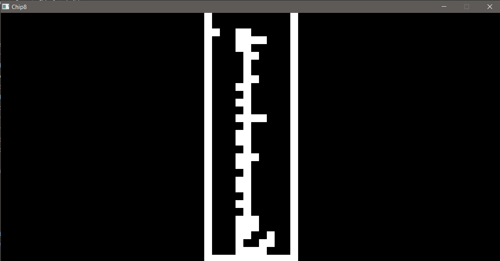

# Chip-8
A chip-8 interpreter/emulator built in C++ using SDL2 for graphics. 

# Screenshots

*Breakout*

*Tetris*
# Build Instructions (Windows and MinGW)

1. Put SDL2 inside "deps" folder in project root directory. 
2. mkdir build
3. cd build
4. cmake -G "MinGW Makefiles" ..
5. mingw32-make
6. ./main.exe \<ROM> \<Scale> \<Delay in hz>

# Notes
The version of SDL2 used is 2.0.22. 

I have only tested on windows with GCC/G++ MinGW but it should work with other compilers.  

Some ROMs that I've successfully managed to run are in the ROMs folder.

# References
[Cowgod's Chip-8 Technical Reference](http://devernay.free.fr/hacks/chip8/C8TECH10.HTM#0.0)

[Austin Morlan's Chip-8 Tutorial](https://austinmorlan.com/posts/chip8_emulator/)

[Tobias V. Langhoff's Chip-8 Tutorial](https://tobiasvl.github.io/blog/write-a-chip-8-emulator/)

[Timendus's Chip-8 Test Suite](https://github.com/Timendus/chip8-test-suite#introduction)

[r/EmuDev](https://www.reddit.com/r/EmuDev/s)

